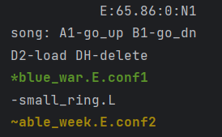

## Menu configuration

MIDI foot controller is coupled with **menu configuration files** which translate notes to looper commands.

Specific configuration are for iRig BlueBoard pedal.

Each configuration directory has 5 files:

* navigate.ini -- control navigation between 4 views of the looper
* play.ini -- main viw that controls playing and recording
* song.ini -- view that control saving and loading of saved songs
* drum.ini -- view that controls drum type and parameters
* serv.ini -- view that controls restart and other service functions

- The screen of each view shows hints for available button mappings. For example in song view:

Top row shows drum type and configuration name, beats per minute
Below are hints for available button mappings:
~~~
A1 go_up -- one tap on button A will scroll the song llist up
B1 go_dn -- one tap on button B will scroll the song list down
D2 load -- two taps on button D will load song
DH delete -- tap and hold of button D will delete song
~~~
Below is list of songs with selected song in green and current song in yellow

